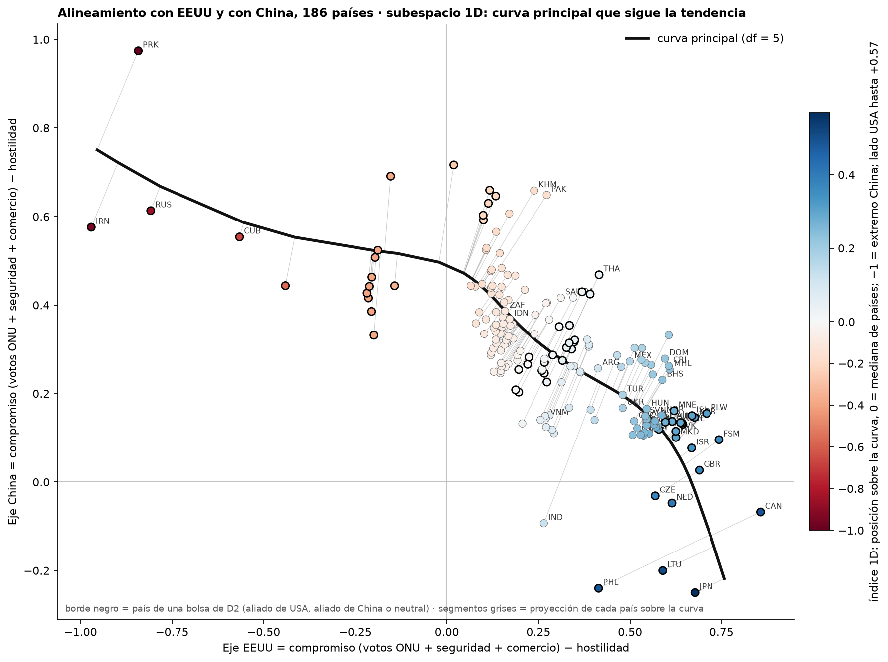
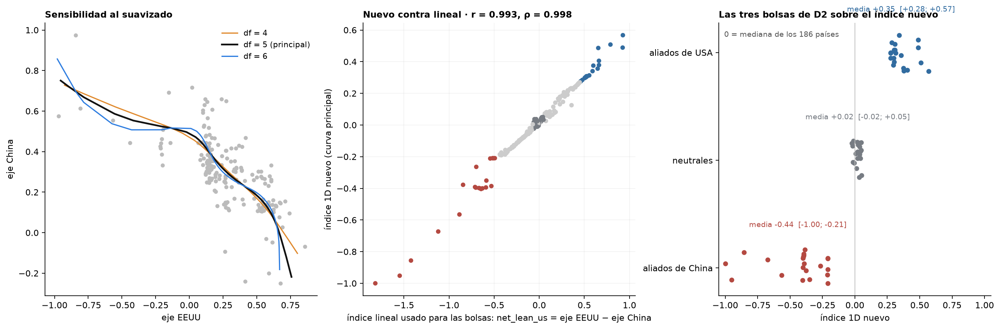

# Índice geopolítico en 1D: curva principal sobre los dos ejes de alineamiento

*computado a pedido de Nico (18/09); método y parámetros a revisar · 2026-09-18 · commit `a4ba7c3` · `47_alignment_index_1d`*

## Question

¿Se puede reemplazar el índice de dos ejes (compromiso con USA, compromiso con China; correlación −0,70) por una posición sobre una curva 1D que siga la tendencia de los datos, reescalada a [−1, +1] entre los extremos?

## Data

- 186 países con los dos ejes completos (build_alignment_axes.py, datos 2022–2025); USA y China no tienen índice. d2_pool marca los países de las bolsas de D2 (aliados de USA, aliados de China, neutrales; 21 + 21 + 21 usados en el banco).

Input files:

- `1_create_dataset/nationality/geopolitics/alignment_axes.csv`
- `4_analysis/results/27_fig3_notelab/country_pools.csv`
- `4_analysis/r/principal_curve.R`

## Method

- princurve::principal_curve (Hastie & Stuetzle), smooth.spline con df = (4, 5, 6), stretch = 2, arranque en la primera componente principal. Índice (decisión de Nico, 18/09: cero en la mediana, extremos asimétricos) = (lambda − mediana de lambda) / max |lambda − mediana|, orientado con el lado USA positivo: el extremo más lejano de la mediana vale ±1 y el otro queda más cerca de 0. La escala anterior (−1 y +1 en los dos extremos) queda en index_1d_extremes. Principal: df = 5; los otros df quedan como sensibilidad. Convergencia: df 4: sí en 7 iteraciones; df 5: sí en 11 iteraciones; df 6: sí en 8 iteraciones.

## Figures

### p1_principal_curve_on_scatter

El gráfico original de los dos ejes (build_alignment_axes.py) con la curva principal encima (línea negra) y la proyección de cada país sobre ella (segmento gris). El color es el índice 1D nuevo: la posición sobre la curva reescalada a [−1, +1] entre los dos extremos (versión de la mañana del 18/09); desde la tarde del 18/09, por decisión de Nico, el cero está en la mediana de los países y los extremos son asimétricos (el más lejano, Corea del Norte, vale −1). Borde negro: países de las bolsas de D2.

### p2_diagnostics

Izquierda: curvas con df = 4, 5, 6. Centro: índice nuevo contra el lineal (colores = bolsas de D2). Derecha: posición de los países de las tres bolsas de D2 sobre el índice nuevo.

## Tables

### alignment_index_1d  (`alignment_index_1d.csv`)

Índice 1D por país (df = 5; cero en la mediana), la versión con cero en el medio de la curva (index_1d_extremes), los dos ejes, el índice lineal net_lean_us, el cuadrante, la bolsa de D2, la proyección sobre la curva (s_us, s_cn), la distancia a la curva y los índices con df = 4 y 6.

## Key numbers  (`stats.json`)

- **pearson_index1d_df4_vs_net_lean**: +1.0 r
- **pearson_index1d_df5_vs_net_lean**: +1.0 r
- **pearson_index1d_df6_vs_net_lean**: +1.0 r
- **spearman_index1d_df4_vs_net_lean**: +1.0 rho
- **spearman_index1d_df5_vs_net_lean**: +1.0 rho
- **spearman_index1d_df6_vs_net_lean**: +1.0 rho
- **pearson_df4_vs_df5**: +1.0 r
- **pearson_df6_vs_df5**: +1.0 r

## Notes and caveats

- Registro: 4_analysis/results/27_fig3_notelab/NARRATIVA_F3.md; decisiones a revisar: 4_analysis/results/DECISIONES_A_REVISAR.md.

## Conclusion (preliminary)

Índice 1D calculado; método y parámetros pendientes de decisión de Nico.
