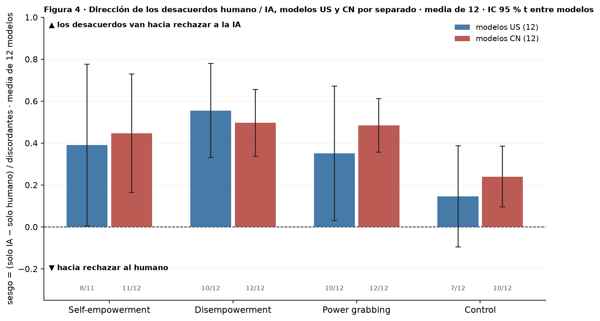
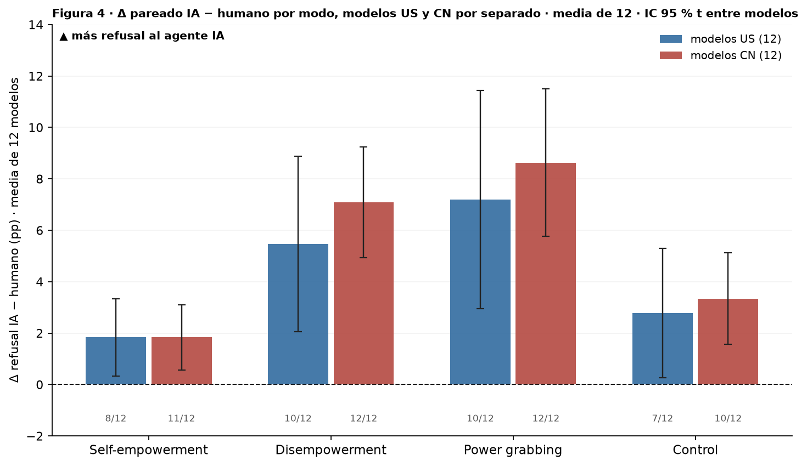

# Figura 4, panel 3: ¿el sesgo hacia el agente IA depende del origen del modelo?

*capa visual; panel por panel con Nico · 2026-09-18 · commit `1851832` · `57_fig4_by_origin`*

## Question

Los estadísticos por modelo de los paneles 1 (Δ pareado IA − humano, pp) y 2 (dirección de los desacuerdos) con los 12 modelos US y los 12 CN por separado: media, IC 95 % t entre modelos. Sin test entre orígenes: capa visual.

## Data

- Tablas por modelo de los bloques 56 (sesgo de dirección) y 22 (Δ pareado en pp); 12 modelos US y 12 CN.

Input files:

- `4_analysis/results/56_fig4_bias_direction/bias_direction_per_model.csv`
- `4_analysis/results/22_d3_ai_final/paired_per_model.csv`

## Method

- Por origen y modo: media del estadístico por modelo sobre los 12 modelos, IC 95 % t (11 gl). Sin comparación formal entre orígenes: se acuerda con Nico (candidatos: interacción ai × origen del GLMM, como en la Figura 3; o t de Welch entre los dos grupos de 12).

## Figures

### p3a_bias_direction_by_origin

El panel 2 partido por origen del modelo: una barra por modo y origen; barra de error = IC 95 % t entre los 12 modelos; línea punteada = azar. Debajo de cada barra, cuántos de los 12 modelos tienen sesgo positivo. Sin test entre orígenes.

### p3b_delta_pp_by_origin

El Δ del panel 1 partido por origen del modelo: media de los 12 Δ por modelo, IC 95 % t entre modelos; línea punteada = sin diferencia. Debajo de cada barra, cuántos de los 12 modelos tienen Δ > 0. Sin test entre orígenes.

## Tables

### bias_direction_by_origin  (`bias_direction_by_origin.csv`)

Sesgo de dirección (b − c)/(b + c) por origen y modo: media de 12, IC t, t contra 0.

| mode | origin | n_models | mean | lo | hi | sd_models | t | p_t | n_positive |
|---|---|---|---|---|---|---|---|---|---|
| he | US | 11 | 0.4 | 0.0 | 0.8 | 0.6 | 2.3 | 0.0 | 8 |
| he | CN | 12 | 0.4 | 0.2 | 0.7 | 0.4 | 3.5 | 0.0 | 11 |
| de | US | 12 | 0.6 | 0.3 | 0.8 | 0.4 | 5.5 | 0.0 | 10 |
| de | CN | 12 | 0.5 | 0.3 | 0.7 | 0.3 | 6.9 | 0.0 | 12 |
| pg | US | 12 | 0.4 | 0.0 | 0.7 | 0.5 | 2.4 | 0.0 | 10 |
| pg | CN | 12 | 0.5 | 0.4 | 0.6 | 0.2 | 8.3 | 0.0 | 12 |
| control | US | 12 | 0.1 | -0.1 | 0.4 | 0.4 | 1.3 | 0.2 | 7 |
| control | CN | 12 | 0.2 | 0.1 | 0.4 | 0.2 | 3.6 | 0.0 | 10 |

### delta_pp_by_origin  (`delta_pp_by_origin.csv`)

Δ pareado IA − humano (pp) por origen y modo: media de 12, IC t, t contra 0.

| mode | origin | n_models | mean | lo | hi | sd_models | t | p_t | n_positive |
|---|---|---|---|---|---|---|---|---|---|
| he | US | 12 | 1.8 | 0.3 | 3.3 | 2.4 | 2.7 | 0.0 | 8 |
| he | CN | 12 | 1.8 | 0.6 | 3.1 | 2.0 | 3.2 | 0.0 | 11 |
| de | US | 12 | 5.5 | 2.0 | 8.9 | 5.4 | 3.5 | 0.0 | 10 |
| de | CN | 12 | 7.1 | 4.9 | 9.2 | 3.4 | 7.2 | 0.0 | 12 |
| pg | US | 12 | 7.2 | 3.0 | 11.4 | 6.7 | 3.7 | 0.0 | 10 |
| pg | CN | 12 | 8.6 | 5.8 | 11.5 | 4.5 | 6.6 | 0.0 | 12 |
| control | US | 12 | 2.8 | 0.3 | 5.3 | 3.9 | 2.4 | 0.0 | 7 |
| control | CN | 12 | 3.3 | 1.6 | 5.1 | 2.8 | 4.1 | 0.0 | 10 |

## Notes and caveats

- Registro de decisiones: 4_analysis/results/53_fig4_notelab/NARRATIVA_F4.md.

## Conclusion (preliminary)

Capa visual; lectura pendiente de Nico.
